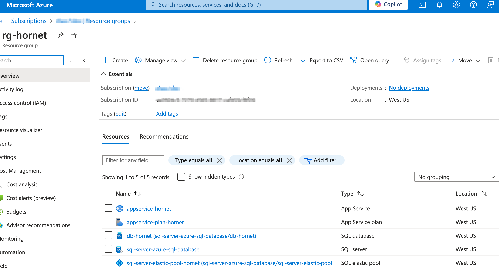
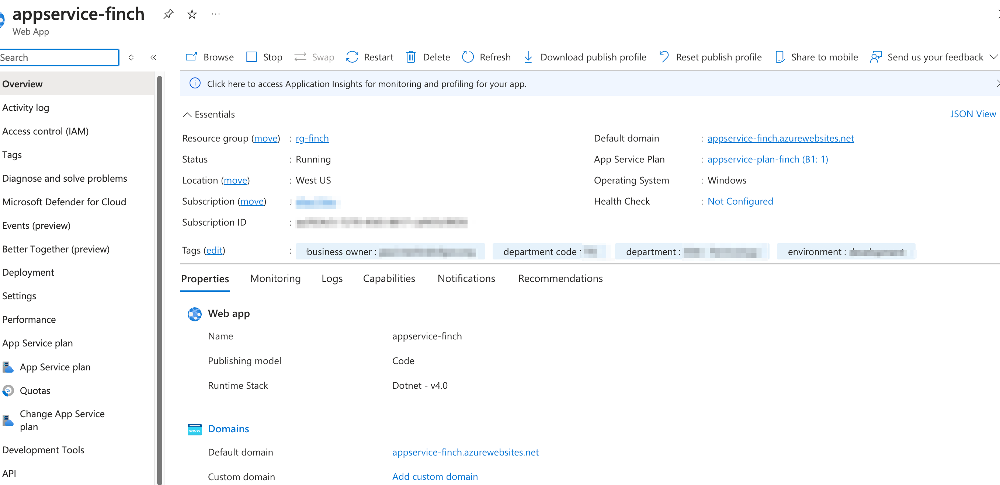
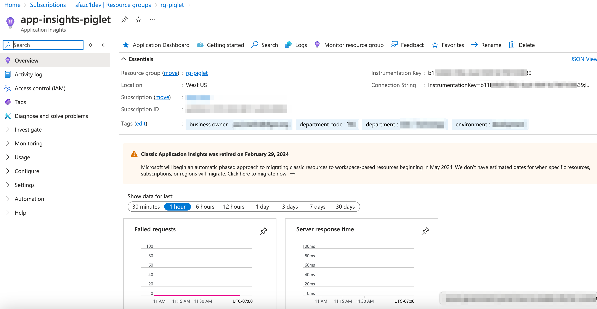

### azure resource group

- terraform [azurerm_resource_group | Resources | hashicorp/azurerm | Terraform | Terraform Registry](https://registry.terraform.io/providers/hashicorp/azurerm/latest/docs/resources/resource_group)
- overview [Azure Resource Manager overview - Azure Resource Manager | Microsoft Learn](https://learn.microsoft.com/en-us/azure/azure-resource-manager/management/overview)
- manage resource group [Manage resource groups - Azure portal - Azure Resource Manager | Microsoft Learn](https://learn.microsoft.com/en-us/azure/azure-resource-manager/management/manage-resource-groups-portal)

### azure sql database



- terraform [azurerm_mssql_database | Resources | hashicorp/azurerm | Terraform | Terraform Registry](https://registry.terraform.io/providers/hashicorp/azurerm/latest/docs/resources/mssql_database)
- azure sql database [Azure SQL Database documentation - Azure SQL | Microsoft Learn](https://learn.microsoft.com/en-us/azure/azure-sql/database/?view=azuresql)
- azure sql databse elstic pool [Manage multiple databases with elastic pools - Azure SQL Database | Microsoft Learn](https://learn.microsoft.com/en-us/azure/azure-sql/database/elastic-pool-overview?view=azuresql)
- migration guide [SQL Server to Azure SQL Database: Migration overview | Microsoft Learn](https://learn.microsoft.com/en-us/data-migration/sql-server/database/overview?toc=%2Fazure%2Fazure-sql%2Ftoc.json&bc=%2Fazure%2Fbread%2Ftoc.json&view=azuresql)
- security [Manage multiple databases with elastic pools - Azure SQL Database | Microsoft Learn](https://learn.microsoft.com/en-us/azure/azure-sql/database/elastic-pool-overview?view=azuresql)
- plan and manage cost [Plan and manage costs - Azure SQL Database | Microsoft Learn](https://learn.microsoft.com/en-us/azure/azure-sql/database/cost-management?view=azuresql)
- monitor [Monitor Azure SQL Database - Azure SQL Database | Microsoft Learn](https://learn.microsoft.com/en-us/azure/azure-sql/database/monitoring-sql-database-azure-monitor?view=azuresql)
- server-level firewall [Create a server-level firewall rule in the Azure portal - Azure SQL Database | Microsoft Learn](https://learn.microsoft.com/en-us/azure/azure-sql/database/firewall-create-server-level-portal-quickstart?view=azuresql)

### azure app service



- terraform [azurerm_app_service | Resources | hashicorp/azurerm | Terraform | Terraform Registry](https://registry.terraform.io/providers/hashicorp/azurerm/latest/docs/resources/app_service)
- terraform windows web app [azurerm_windows_web_app | Resources | hashicorp/azurerm | Terraform | Terraform Registry](https://registry.terraform.io/providers/hashicorp/azurerm/latest/docs/resources/windows_web_app)
- app service [Overview of Azure App Service - Azure App Service | Microsoft Learn](https://learn.microsoft.com/en-us/azure/app-service/overview)
- app service plan [App Service plans - Azure App Service | Microsoft Learn](https://learn.microsoft.com/en-us/azure/app-service/overview-hosting-plans)
- app service asp.net web app [Quickstart: Deploy an ASP.NET web app - Azure App Service | Microsoft Learn](https://learn.microsoft.com/en-us/azure/app-service/quickstart-dotnetcore?tabs=net80&pivots=development-environment-vs)
- monitor [Monitor Azure App Service - Azure App Service | Microsoft Learn](https://learn.microsoft.com/en-us/azure/app-service/monitor-app-service)
- domain and certificate [Tutorial: Secure app with a custom domain and certificate - Azure App Service | Microsoft Learn](https://learn.microsoft.com/en-us/azure/app-service/tutorial-secure-domain-certificate)
- scale-up [Scale up features and capacities - Azure App Service | Microsoft Learn](https://learn.microsoft.com/en-us/azure/app-service/manage-scale-up)
- security [Security - Azure App Service | Microsoft Learn](https://learn.microsoft.com/en-us/azure/app-service/overview-security)
- webjobs [Run background tasks with WebJobs - Azure App Service | Microsoft Learn](https://learn.microsoft.com/en-us/azure/app-service/webjobs-create?tabs=windowscode)
- deployment and configuration [Deployment best practices - Azure App Service | Microsoft Learn](https://learn.microsoft.com/en-us/azure/app-service/deploy-best-practices)
- asp.net framework 4.7 sample code on ""wwwroot\asp-net-examples"" folder

### azure app insights



- terraform [azurerm_application_insights | Resources | hashicorp/azurerm | Terraform | Terraform Registry](https://registry.terraform.io/providers/hashicorp/azurerm/latest/docs/resources/application_insights)
- app insights [Application Insights overview - Azure Monitor | Microsoft Learn](https://learn.microsoft.com/en-us/azure/azure-monitor/app/app-insights-overview)
- azure monitor [Azure Monitor documentation - Azure Monitor | Microsoft Learn](https://learn.microsoft.com/en-us/azure/azure-monitor/)
- action group [Azure Monitor action groups - Azure Monitor | Microsoft Learn](https://learn.microsoft.com/en-us/azure/azure-monitor/alerts/action-groups)

### IaC terraform script

```bash
## az cli https://learn.microsoft.com/en-us/cli/azure/
az cloud set --name azurecloud
az login

az account list
az account show
az account set --subscription 

## or azure cloud shell https://learn.microsoft.com/en-us/azure/cloud-shell/overview

## https://developer.hashicorp.com/terraform/install
cd terraform
# Clean the provider cache
#rm -rf .terraform
#rm -f .terraform.lock.hcl

terraform init
#terraform console
terraform plan
terraform apply --auto-approve
terraform show ## Show the current state
terraform output --json ##sql database connection string

## get the publish profiles for the app service - ftp, sftp ...
az webapp deployment list-publishing-profiles --name <your_app_service_name> --resource-group <your_resource_group_name> --output json

## clean resource
terraform destroy --auto-approve

```
