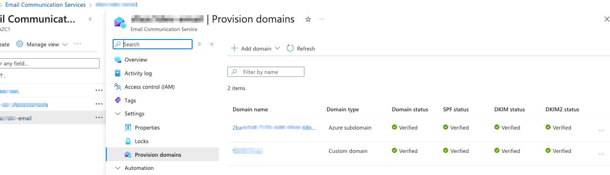
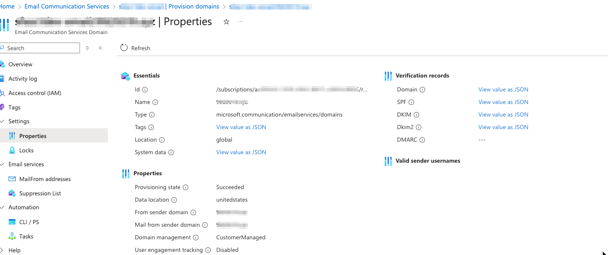
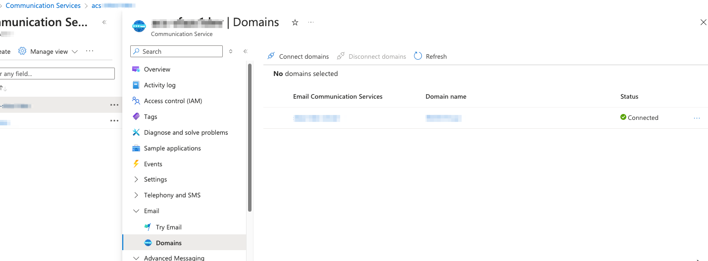

- https://learn.microsoft.com/en-us/azure/communication-services/
- **acs:** Azure Communication Service
- **aecs:** Azure Email Communication Service

#### Benefits of Azure Communication Services for email communication:

1. **Scalability**: Easily scale to handle large volumes of emails without managing infrastructure.
2. **Integration**: Seamlessly integrate with other Azure services and applications.
3. **Security**: Benefit from Azure's robust security features, including encryption and compliance.
4. **Reliability**: High availability and reliability with Azure's global infrastructure.
5. **Analytics**: Gain insights with built-in analytics and monitoring tools.

*Note: This service is for sending emails, not for email hosting or receiving emails.*

#### Email Communication Service

- create "email communication service" and provision custom domain
- Settings -> Provision domains
- DNS domian verification TXT record
- SPF
- DKIM1 DKIM2





#### Communication Service

- "Communication Service - support email and others (voice, SMS, chat, call automation...)
- endpoint https://acs-xxxxxx.unitedstates.communication.azure.com/
- Settings -> Keys -> Connection string
- no **SMTP** support - use azure.communication.email SDK
- Emails -> Domains -> Connect domains



```python
from azure.communication.email import EmailClient

def main():
    try:
        connection_string = ""endpoint=https://acs-xxx.unitedstates.communication.azure.com/;accesskey=1c....""
        client = EmailClient.from_connection_string(connection_string)

        message = {
            "senderAddress": "DoNotReply@<from_domain>",
            "recipients": {
                "to": [{"address": "<to_email>"}]
            },
            "content": {
                "subject": "Test Email",
                "plainText": "Hello world via email.",
                "html": """
				<html>
					<body>
						<h1>Hello world via email.</h1>
					</body>
				</html>"""
            },
  
        }

        poller = client.begin_send(message)
        result = poller.result()
        print("Message sent: ", result.message_id)

    except Exception as ex:
        print(ex)

main()

```

#### monitoring

- insights
- metrics
- logs
- workbooks
