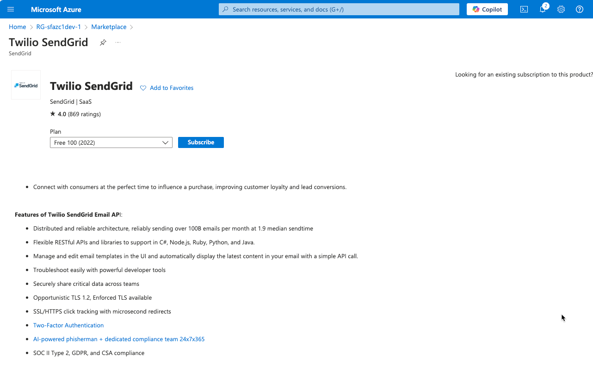

- https://www.twilio.com/docs/sendgrid/for-developers/partners/microsoft-azure

#### sendgrid setup on Azure

- marketplace -> sendgrid or twillo sendgrid
- 
- smtp or restful API

1. **Scalability**: Easily handle large volumes of emails with SendGrid's scalable infrastructure.
2. **Deliverability**: High deliverability rates with advanced email delivery optimization and reputation management.
3. **Integration**: Seamlessly integrate with Azure services and other applications via APIs and SDKs.
4. **Analytics**: Gain insights with detailed analytics and reporting on email performance.
5. **Security**: Benefit from robust security features, including encryption, compliance, and authentication mechanisms.

*Note: Azure SendGrid is designed for sending emails, not for email hosting or receiving emails.*


SendGrid primarily focuses on sending emails, but it also provides an Inbound Parse Webhook feature that allows you to receive and process incoming emails. Here’s how the process works:

### SendGrid Inbound Parse Webhook Process

1. **Set Up a Domain**:

   - Configure a domain or subdomain to receive emails. For example, `inbound.yourdomain.com`.
2. **Configure DNS Records**:

   - Set up MX records for your domain to point to SendGrid’s mail servers.
3. **Set Up the Inbound Parse Webhook**:

   - In the SendGrid dashboard, configure the Inbound Parse Webhook to specify the domain and the URL endpoint where SendGrid should POST the parsed email data.
4. **Receive and Process Emails**:

   - When an email is sent to your configured domain, SendGrid parses the email and sends the content (including attachments) to your specified URL endpoint as a POST request.
   - Your application receives the POST request and processes the email data as needed.

### Example Configuration Steps

1. **DNS Configuration**:

   - Add MX records for your domain to point to SendGrid’s mail servers.
2. **SendGrid Dashboard Configuration**:

   - Go to the SendGrid dashboard.
   - Navigate to `Settings` > `Inbound Parse`.
   - Add a new Inbound Parse Webhook.
   - Specify the domain and the URL endpoint where SendGrid should send the parsed email data.
3. **Endpoint to Receive Emails**:

   - Create an endpoint in your application to handle the incoming POST requests from SendGrid.

### Example Endpoint in Node.js

```javascript
const express = require('express');
const bodyParser = require('body-parser');

const app = express();
app.use(bodyParser.json());

app.post('/email/inbound', (req, res) => {
    const emailData = req.body;
    console.log('Received email:', emailData);

    // Process the email data as needed
    // For example, save to database, trigger notifications, etc.

    res.status(200).send('Email received');
});

const PORT = process.env.PORT || 3000;
app.listen(PORT, () => {
    console.log(`Server is running on port ${PORT}`);
});
```

### Summary

By using SendGrid’s Inbound Parse Webhook, you can receive and process incoming emails by configuring your domain, setting up DNS records, and creating an endpoint to handle the parsed email data sent by SendGrid.
