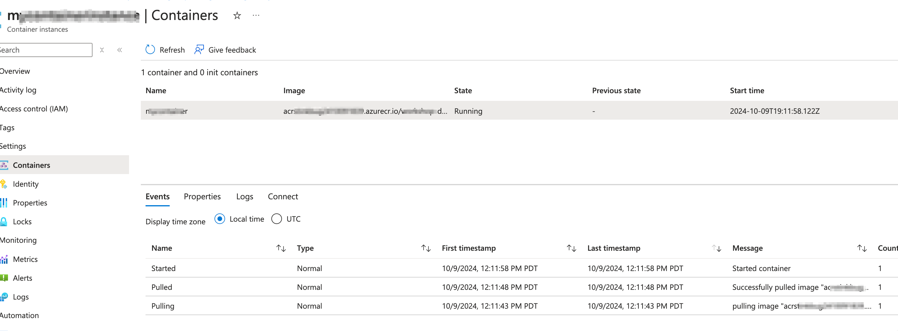

#### terraform

```
az login
az account show

terraform init
terraform plan
terraform apply --auto-approve

chmod +x push-image-to-acr.sh
./push-image-to-acr.sh

## clean up
terraform destroy --auto-approve
```

### no port mapping
- Azure Container Instances (ACI) does not support Docker-style port mapping (e.g., `8080:80`). Instead, you need to expose the port directly and configure your application to listen on the desired port. If you want to expose port 80 externally and have your application listen on port 8080 internally, you should configure your application to listen on port 8080 and expose port 80 in the ACI configuration.
- check azure app service for container that support port mapping


