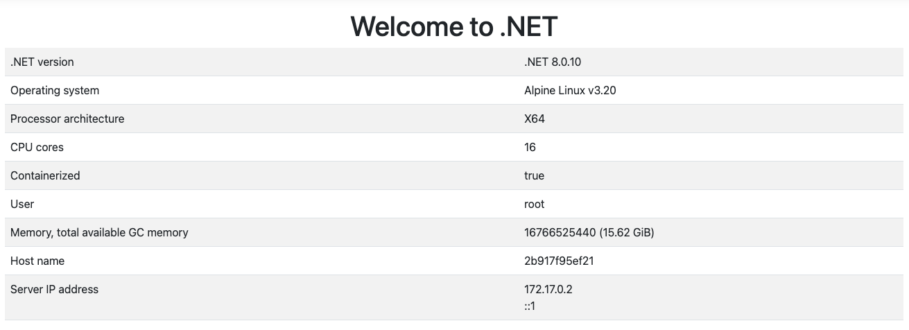

- https://learn.microsoft.com/en-us/aspnet/core/host-and-deploy/docker/building-net-docker-images?view=aspnetcore-8.0
- https://github.com/dotnet/dotnet-docker
- https://hub.docker.com/r/microsoft/dotnet-samples/

```
docker info
docker images
docker ps

## dotbetapp
docker pull mcr.microsoft.com/dotnet/samples:dotnetapp

docker run --rm <image name>
## aspnet app
docker pull mcr.microsoft.com/dotnet/samples:aspnetapp
docker run -it --rm -p 8000:8080 --name aspnetcore_sample mcr.microsoft.com/dotnet/samples:aspnetapp

```


