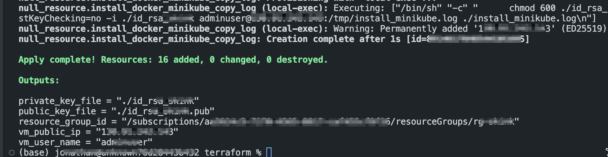

#### provisioning minikube env on azure vm (ubuntu 24.04)

```bash
cd terraform

terraform init
terrafrom plan
terraform apply --auto-approve
terraform output

## from terraform output
chmod 600 ./<private-key-file-name>
ssh -i ./<private-key-file-name> adminuser@<ubuntu-server-public-ip-address>

## check lab script file & yaml

## clean up resource
terraform destroy --auto-approve

```


