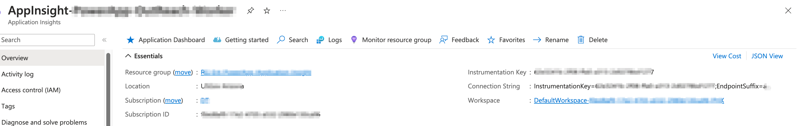

#### create an azure application insight for web



#### enable application insights in power apps


To view telemetry information, your tenant admin must enable  **Canvas app insights** . Sign in as an admin in [Power Platform admin center](https://admin.powerplatform.microsoft.com/). Go to **Settings** > **Tenant settings** >  **Canvas app insights** . In the **Canvas app insights** pane, set the toggle to **On** and save your changes. Fore more information, see [Tenant settings](https://learn.microsoft.com/en-us/power-platform/admin/tenant-settings).

* application insight instrumentation key
* power app create custom trace events - (trace/log level info, warning, error)

  ```Power Fx
  Trace(
     "App Feedback",
     TraceSeverity.Information,
         {
           UserName: User().FullName,
           UserEmail: User().Email,
           Screen: FeedbackComponent.FeedbackScreen.Name,
           FeedbackValue: "-1"
         }
       );
  Notify("Thanks for your feedback!");
  ```

#### collect log and metrics

#### analytics

---

ref

- https://www.youtube.com/watch?v=nokrKJ2SfsE
- https://www.youtube.com/@mspowerplatform
- https://learn.microsoft.com/en-us/power-apps/maker/canvas-apps/application-insights
-
