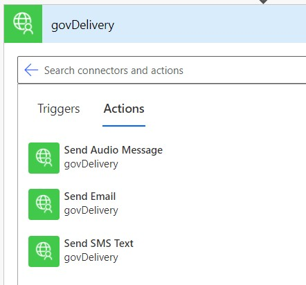
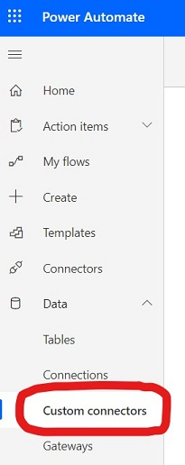
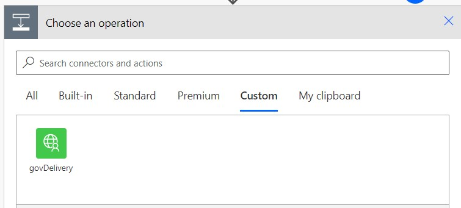

# govDelivery Custom Connector
This sample shows how to easily consume govDelivery APIs to send SMS text messages and email notifications to citizens.  We have also provided a sample custom connector that streamlines the process to get started and building Power Automate Flows with govDelivery.



Sample Power Automate Flow below using the custom connector,


## Installing the Custom Connector
To get started, you will need a govDelivery account and an API key to connect to their APIs.  Details on govDelivery's APIs can be found below,

[govDelivery API Docs](https://developer.govdelivery.com/api/tms/overview/Setup/)

To install the sample custom connector, download the following swagger OpenAPI connection file,

[govDelivery Swagger Definition File](files/govDelivery.swagger.json)

Next, go to Power Automate > Data > Custom Connectors.



Next, create a new custom connector from an OpenAPI file,


Import the ```govDelivery.swagger.json``` you downloaded previously.  Name the connector ```govDelivery```


Click on "Create connector".  Now go to Test and then create a new connection,


You will need to then input the API key assigned from govDelivery,


Refresh the connections and you should now see the new connection you just created,


Now you can test the connector by sending SMS text messages or emails!


You can also now use this custom connector in any Power Automate Flows in the environment you installed the custom connector in,



Below is a sample Flow using the custom connector,


