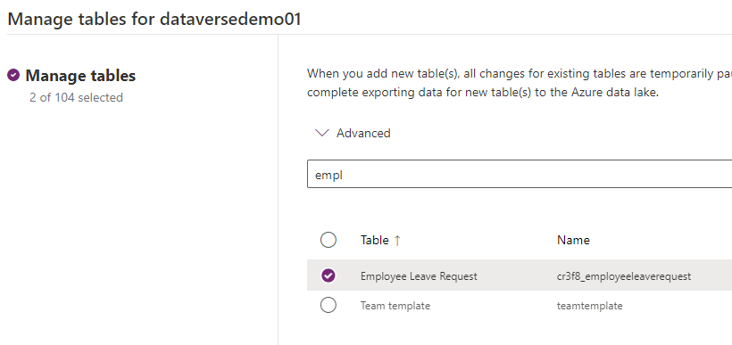
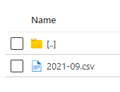
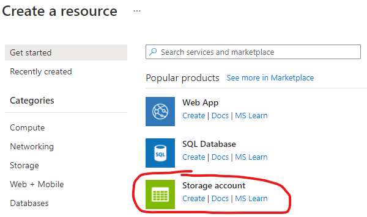
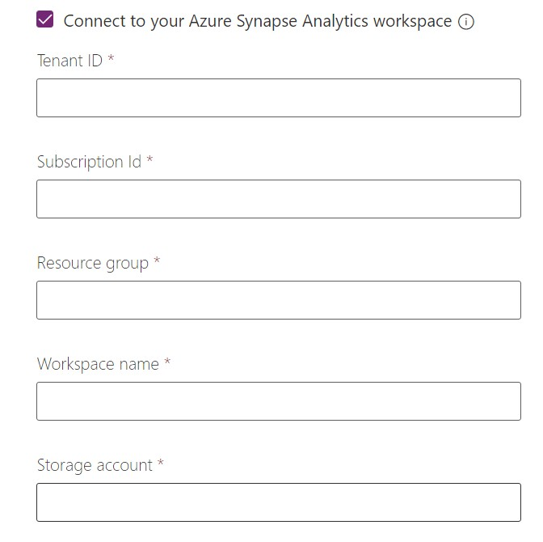

# Power Platform Azure Synapse Link Integration
> This feature is live in the GCC and GCCH clouds.

## Overview of the Feature
Azure Synapse integration with Power Platform Dataverse allows you to sync data automatically from select tables in Dataverse into an Azure Data Lake Storage Account.  Below is an example of how it works once Azure Synapse Link is already setup.  Full setup notes for GCC and GCCH are included below.

1. Make sure the Dataverse table you want to sync is marked to enable change tracking.


2. Go to the Azure Synapse Link page and then lookup the Dataverse table you want to sync



3. Once configured, the Dataverse table will do an initial synchronization and then all future updates will get pushed to Azure Data Lake Storage


4. Now when you add or modify rows in the Dataverse table, they will automatically get pushed into the configured Azure Data Lake Storage Account.


5. When you view the configured Azure Storage account you will see new containers provisioned by the Power Platform service,


6. When you drill into an environment's container you will then see all tables that are actively being synchronized.


7. Drilling into the tables container you will see a series of CSV files that contain the Dataverse data.



8. And if you open up one of the CSV files, you can see the actual contents which in this case matches the initial form submission in Power Apps.


9. Optionally, you can create an Azure Synapse Workspace that is associated with the Azure Data Lake Storage account.  This allows you to query with familiar SQL queries against all Dataverse data being synchronized!


## GCC/GCCH Setup

You have two implementation options to integrate Power Platform Dataverse tables with Azure Synapse Link.  

Option 1 is to use an Azure Commercial subscription that is associated to the same tenant as your O365 subscription.  Option 2 is to use an Azure for Government subscription.

### Azure Commercial Subscription
Below is an architecture diagram of how everything is laid out with this setup,


If you have an associated Azure Commercial subscription with your tenant, then you can follow the commercial public docs to set this up,

[Azure Synapse Link Setup Documentation](https://docs.microsoft.com/en-us/powerapps/maker/data-platform/azure-synapse-link-synapse)

### Azure Commercial Advanced Networking Configuration
If you want to setup your Azure Synapse Workspace and your Azure Storage account to restrict the IP addresses that can access them, you will need to do an additional step to allow Power Platform GCC to access those resources.

When you go to create a new Azure Synapse Link, it will tell you your environment is located in US Gov Virginia, or US Gov Texas.  You will need to download the latest Azure for Government IP Ranges documentation below,

[Azure IP Ranges and Service Tags for Azure for Government](https://www.microsoft.com/download/details.aspx?id=57063)

Next, if you are in the US Gov Virginia region, look for the ```PowerPlatformInfra.USGovVirginia``` service tag.  

> [!IMPORTANT]
> The below snippet is meant to be an example of what service tag to look for.  These IP ranges do get updated and the best source of truth is to get these from here => [Azure IP Ranges and Service Tags for Azure for Government](https://www.microsoft.com/download/details.aspx?id=57063)

````json
{
      "name": "PowerPlatformInfra.USGovVirginia",
      "id": "PowerPlatformInfra.USGovVirginia",
      "properties": {
        "changeNumber": 5,
        "region": "usgovvirginia",
        "regionId": 42,
        "platform": "Azure",
        "systemService": "PowerPlatformInfra",
        "addressPrefixes": [
          "20.141.167.160/29",
          "20.158.8.248/32",
          "20.159.0.16/28",
          "20.159.0.32/28",
          "20.159.0.64/26",
          "52.127.52.124/30",
          "52.127.53.0/26",
          "52.127.53.64/27",
          "52.127.53.96/29",
          "52.127.53.112/28",
          "52.127.53.128/25",
          "52.127.54.0/28",
          "52.127.55.136/29",
          "52.127.55.144/29",
          "52.227.216.40/32",
          "52.227.228.164/32",
          "52.227.232.14/32",
          "52.227.232.88/32",
          "52.227.232.254/32",
          "52.245.211.174/32",
          "52.245.239.198/32",
          "2001:489a:2102:1080::/58",
          "2001:489a:2102:1480::/58"
        ],
        "networkFeatures": [
          "API",
          "NSG",
          "FW"
        ]
      }
    }
````

If you are in US Gov Texas, look for the ```PowerPlatformInfra.USGovTexas``` service tag.

> [!IMPORTANT]
> The below snippet is meant to be an example of what service tag to look for.  These IP ranges do get updated and the best source of truth is to get these from here => [Azure IP Ranges and Service Tags for Azure for Government](https://www.microsoft.com/download/details.aspx?id=57063)

````json
{
      "name": "PowerPlatformInfra.USGovTexas",
      "id": "PowerPlatformInfra.USGovTexas",
      "properties": {
        "changeNumber": 5,
        "region": "usgovtexas",
        "regionId": 41,
        "platform": "Azure",
        "systemService": "PowerPlatformInfra",
        "addressPrefixes": [
          "20.140.59.12/30",
          "20.140.59.16/28",
          "20.140.59.32/28",
          "20.140.59.48/29",
          "20.140.59.64/26",
          "20.140.59.128/25",
          "20.140.60.0/27",
          "20.140.144.96/28",
          "52.126.178.146/32",
          "52.126.191.93/32",
          "52.243.155.223/32",
          "52.243.156.135/32",
          "52.243.159.108/32",
          "52.243.159.166/32",
          "52.243.159.168/32",
          "52.243.242.48/28",
          "52.243.242.160/28",
          "52.243.242.184/29",
          "52.243.242.192/26",
          "52.245.170.221/32",
          "2001:489a:2102:1000::/58",
          "2001:489a:2102:1400::/58"
        ],
        "networkFeatures": [
          "API",
          "NSG",
          "FW"
        ]
      }
    }
````

Azure Synapse requires a start and end IP address and does not use CIDR.  To easily convert CIDR ranges to start and stop IP addresses, you can use the PowerShell script referenced below,

[CIDR to IP Address Range PowerShell Script](files/CIDRtoIpRange.ps1)

An example of using the ```CIDRtoIpRange.ps1``` script is below,

````powershell
.\CIDRtoIpRange.ps1 -IPAddressJsonFilePath "C:\Misc\ServiceTags_AzureGovernment_20220214.json" -ServiceTagName "PowerPlatformInfra.USGovTexas"
````

The sample output from this command are below,

> [!IMPORTANT]
> The below snippet is meant to be an example of what service tag to look for.  These IP ranges do get updated and the best source of truth is to get these from here => [Azure IP Ranges and Service Tags for Azure for Government](https://www.microsoft.com/download/details.aspx?id=57063)

````
IP Ranges for PowerPlatformInfra.USGovVirginia below =>

20.141.167.161 : 20.141.167.167
20.158.8.248 : 20.158.8.248
20.159.0.17 : 20.159.0.31
20.159.0.33 : 20.159.0.47
20.159.0.65 : 20.159.0.127
52.127.52.125 : 52.127.52.127
52.127.53.1 : 52.127.53.63
52.127.53.65 : 52.127.53.95
52.127.53.97 : 52.127.53.103
52.127.53.113 : 52.127.53.127
52.127.53.129 : 52.127.53.255
52.127.54.1 : 52.127.54.15
52.127.55.137 : 52.127.55.143
52.127.55.145 : 52.127.55.151
52.227.216.40 : 52.227.216.40
52.227.228.164 : 52.227.228.164
52.227.232.14 : 52.227.232.14
52.227.232.88 : 52.227.232.88
52.227.232.254 : 52.227.232.254
52.245.211.174 : 52.245.211.174
52.245.239.198 : 52.245.239.198
2001:489a:2102:1080:0000:0000:0000:0000 : 2001:489a:2102:10bf:ffff:ffff:ffff:ffff
2001:489a:2102:1480:0000:0000:0000:0000 : 2001:489a:2102:14bf:ffff:ffff:ffff:ffff


Sample Storage Account PowerShell Script =>
````
````powershell
$storageAccountName = "INSERT_STORAGE_ACCOUNT_HERE"
$resourceGroupName = "INSERT_RESOURCE_GROUP_HERE"

Add-AzStorageAccountNetworkRule -ResourceGroupName $resourceGroupName -Name $storageAccountName -IPAddressOrRange 20.141.167.160/29
Add-AzStorageAccountNetworkRule -ResourceGroupName $resourceGroupName -Name $storageAccountName -IPAddressOrRange 20.158.8.248
Add-AzStorageAccountNetworkRule -ResourceGroupName $resourceGroupName -Name $storageAccountName -IPAddressOrRange 20.159.0.16/28
Add-AzStorageAccountNetworkRule -ResourceGroupName $resourceGroupName -Name $storageAccountName -IPAddressOrRange 20.159.0.32/28
Add-AzStorageAccountNetworkRule -ResourceGroupName $resourceGroupName -Name $storageAccountName -IPAddressOrRange 20.159.0.64/26
Add-AzStorageAccountNetworkRule -ResourceGroupName $resourceGroupName -Name $storageAccountName -IPAddressOrRange 52.127.52.124/30
Add-AzStorageAccountNetworkRule -ResourceGroupName $resourceGroupName -Name $storageAccountName -IPAddressOrRange 52.127.53.0/26
Add-AzStorageAccountNetworkRule -ResourceGroupName $resourceGroupName -Name $storageAccountName -IPAddressOrRange 52.127.53.64/27
Add-AzStorageAccountNetworkRule -ResourceGroupName $resourceGroupName -Name $storageAccountName -IPAddressOrRange 52.127.53.96/29
Add-AzStorageAccountNetworkRule -ResourceGroupName $resourceGroupName -Name $storageAccountName -IPAddressOrRange 52.127.53.112/28
Add-AzStorageAccountNetworkRule -ResourceGroupName $resourceGroupName -Name $storageAccountName -IPAddressOrRange 52.127.53.128/25
Add-AzStorageAccountNetworkRule -ResourceGroupName $resourceGroupName -Name $storageAccountName -IPAddressOrRange 52.127.54.0/28
Add-AzStorageAccountNetworkRule -ResourceGroupName $resourceGroupName -Name $storageAccountName -IPAddressOrRange 52.127.55.136/29
Add-AzStorageAccountNetworkRule -ResourceGroupName $resourceGroupName -Name $storageAccountName -IPAddressOrRange 52.127.55.144/29
Add-AzStorageAccountNetworkRule -ResourceGroupName $resourceGroupName -Name $storageAccountName -IPAddressOrRange 52.227.216.40
Add-AzStorageAccountNetworkRule -ResourceGroupName $resourceGroupName -Name $storageAccountName -IPAddressOrRange 52.227.228.164
Add-AzStorageAccountNetworkRule -ResourceGroupName $resourceGroupName -Name $storageAccountName -IPAddressOrRange 52.227.232.14
Add-AzStorageAccountNetworkRule -ResourceGroupName $resourceGroupName -Name $storageAccountName -IPAddressOrRange 52.227.232.88
Add-AzStorageAccountNetworkRule -ResourceGroupName $resourceGroupName -Name $storageAccountName -IPAddressOrRange 52.227.232.254
Add-AzStorageAccountNetworkRule -ResourceGroupName $resourceGroupName -Name $storageAccountName -IPAddressOrRange 52.245.211.174
Add-AzStorageAccountNetworkRule -ResourceGroupName $resourceGroupName -Name $storageAccountName -IPAddressOrRange 52.245.239.198
Add-AzStorageAccountNetworkRule -ResourceGroupName $resourceGroupName -Name $storageAccountName -IPAddressOrRange 2001:489a:2102:1080::/58
Add-AzStorageAccountNetworkRule -ResourceGroupName $resourceGroupName -Name $storageAccountName -IPAddressOrRange 2001:489a:2102:1480::/58

````
````
Sample Azure Synapse PowerShell Script =>
````
````powershell
$synapseWorkspaceName = "INSET_SYNAPSE_WORKSPACE_HERE"

New-AzSynapseFirewallRule -WorkspaceName $synapseWorkspaceName -Name PowerPlatformInfra.USGovVirginia-1 -StartIpAddress "20.141.167.161" -EndIpAddress "20.141.167.167"
New-AzSynapseFirewallRule -WorkspaceName $synapseWorkspaceName -Name PowerPlatformInfra.USGovVirginia-2 -StartIpAddress "20.158.8.248" -EndIpAddress "20.158.8.248"
New-AzSynapseFirewallRule -WorkspaceName $synapseWorkspaceName -Name PowerPlatformInfra.USGovVirginia-3 -StartIpAddress "20.159.0.17" -EndIpAddress "20.159.0.31"
New-AzSynapseFirewallRule -WorkspaceName $synapseWorkspaceName -Name PowerPlatformInfra.USGovVirginia-4 -StartIpAddress "20.159.0.33" -EndIpAddress "20.159.0.47"
New-AzSynapseFirewallRule -WorkspaceName $synapseWorkspaceName -Name PowerPlatformInfra.USGovVirginia-5 -StartIpAddress "20.159.0.65" -EndIpAddress "20.159.0.127"
New-AzSynapseFirewallRule -WorkspaceName $synapseWorkspaceName -Name PowerPlatformInfra.USGovVirginia-6 -StartIpAddress "52.127.52.125" -EndIpAddress "52.127.52.127"
New-AzSynapseFirewallRule -WorkspaceName $synapseWorkspaceName -Name PowerPlatformInfra.USGovVirginia-7 -StartIpAddress "52.127.53.1" -EndIpAddress "52.127.53.63"
New-AzSynapseFirewallRule -WorkspaceName $synapseWorkspaceName -Name PowerPlatformInfra.USGovVirginia-8 -StartIpAddress "52.127.53.65" -EndIpAddress "52.127.53.95"
New-AzSynapseFirewallRule -WorkspaceName $synapseWorkspaceName -Name PowerPlatformInfra.USGovVirginia-9 -StartIpAddress "52.127.53.97" -EndIpAddress "52.127.53.103"
New-AzSynapseFirewallRule -WorkspaceName $synapseWorkspaceName -Name PowerPlatformInfra.USGovVirginia-10 -StartIpAddress "52.127.53.113" -EndIpAddress "52.127.53.127"
New-AzSynapseFirewallRule -WorkspaceName $synapseWorkspaceName -Name PowerPlatformInfra.USGovVirginia-11 -StartIpAddress "52.127.53.129" -EndIpAddress "52.127.53.255"
New-AzSynapseFirewallRule -WorkspaceName $synapseWorkspaceName -Name PowerPlatformInfra.USGovVirginia-12 -StartIpAddress "52.127.54.1" -EndIpAddress "52.127.54.15"
New-AzSynapseFirewallRule -WorkspaceName $synapseWorkspaceName -Name PowerPlatformInfra.USGovVirginia-13 -StartIpAddress "52.127.55.137" -EndIpAddress "52.127.55.143"
New-AzSynapseFirewallRule -WorkspaceName $synapseWorkspaceName -Name PowerPlatformInfra.USGovVirginia-14 -StartIpAddress "52.127.55.145" -EndIpAddress "52.127.55.151"
New-AzSynapseFirewallRule -WorkspaceName $synapseWorkspaceName -Name PowerPlatformInfra.USGovVirginia-15 -StartIpAddress "52.227.216.40" -EndIpAddress "52.227.216.40"
New-AzSynapseFirewallRule -WorkspaceName $synapseWorkspaceName -Name PowerPlatformInfra.USGovVirginia-16 -StartIpAddress "52.227.228.164" -EndIpAddress "52.227.228.164"
New-AzSynapseFirewallRule -WorkspaceName $synapseWorkspaceName -Name PowerPlatformInfra.USGovVirginia-17 -StartIpAddress "52.227.232.14" -EndIpAddress "52.227.232.14"
New-AzSynapseFirewallRule -WorkspaceName $synapseWorkspaceName -Name PowerPlatformInfra.USGovVirginia-18 -StartIpAddress "52.227.232.88" -EndIpAddress "52.227.232.88"
New-AzSynapseFirewallRule -WorkspaceName $synapseWorkspaceName -Name PowerPlatformInfra.USGovVirginia-19 -StartIpAddress "52.227.232.254" -EndIpAddress "52.227.232.254"
New-AzSynapseFirewallRule -WorkspaceName $synapseWorkspaceName -Name PowerPlatformInfra.USGovVirginia-20 -StartIpAddress "52.245.211.174" -EndIpAddress "52.245.211.174"
New-AzSynapseFirewallRule -WorkspaceName $synapseWorkspaceName -Name PowerPlatformInfra.USGovVirginia-21 -StartIpAddress "52.245.239.198" -EndIpAddress "52.245.239.198"
New-AzSynapseFirewallRule -WorkspaceName $synapseWorkspaceName -Name PowerPlatformInfra.USGovVirginia-22 -StartIpAddress "2001:489a:2102:1080:0000:0000:0000:0000" -EndIpAddress "2001:489a:2102:10bf:ffff:ffff:ffff:ffff"
New-AzSynapseFirewallRule -WorkspaceName $synapseWorkspaceName -Name PowerPlatformInfra.USGovVirginia-23 -StartIpAddress "2001:489a:2102:1480:0000:0000:0000:0000" -EndIpAddress "2001:489a:2102:14bf:ffff:ffff:ffff:ffff"

````

### Azure for Government Subscription

Below is an architecture diagram of how everything is laid out in this setup,


### Setup Notes for Azure for Government

> Important: you need to have at least Application Administrator privileges to create a new Service Principal. Global Administrator would work as well.  

Use the PowerShell script below in your Azure for Government subscription to provision the "Export to data lake" service principal account.

```powershell
# Authenticate to Azure for Government
Connect-AzAccount -Environment AzureUSGovernment 

# Provision the "Export to data lake" Service Principal account
# This Application ID needs to be hard coded to the exact GUID below
# Once you create the Service Principal, the name will show up as "Export to data lake"
New-AzADServicePrincipal -ApplicationId '7f15f9d9-cad0-44f1-bbba-d36650e07765' 
```

Next you need to create an Azure Storage account (Gen 2).



Make sure you mark "Enable hierarchical namespace" in the advanced section.


Once provisioned, you need to grant the "Export to data lake" service principal the following role assignments in IAM,

* Owner
* Storage Account Contributor
* Storage Blob Data Contributor
* Storage Blob Data Owner

Open up the Marker Portal in GCC (https://make.gov.powerapps.us) and select the environment you want to setup.

Click on the Azure Synapse Link menu item


Add the following query string ```?athena.advancedSetup=true``` to configure cross Tenant setup and ```&athena.synapse=true``` for Azure Synapse Analytics integration the end of the URL and load the page.  For example,

```
https://make.gov.powerapps.us/environments/aaaaaa-xxx-4442-8f7e-229b080exxx/exporttodatalake?athena.advancedSetup=true&athena.synapse=true
```

Click on "New link to data lake"


Fill out the following fields,



Select next.  Choose the Dataverse tables you want to sync and finish the setup.

> If you get an error that a file system name does not exist, you may need to manually create the storage container via the Azure Portal.


Once that is working, you can optionally provision Azure Synapse Analytics using the already configured Azure Storage account.
