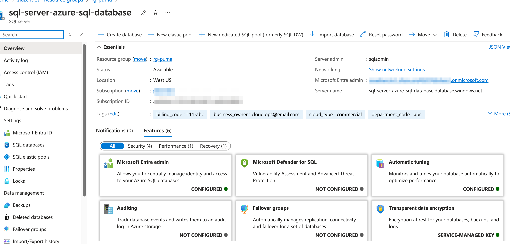

### azure resource group

- terraform [azurerm_resource_group | Resources | hashicorp/azurerm | Terraform | Terraform Registry](https://registry.terraform.io/providers/hashicorp/azurerm/latest/docs/resources/resource_group)
- overview [Azure Resource Manager overview - Azure Resource Manager | Microsoft Learn](https://learn.microsoft.com/en-us/azure/azure-resource-manager/management/overview)
- manage resource group [Manage resource groups - Azure portal - Azure Resource Manager | Microsoft Learn](https://learn.microsoft.com/en-us/azure/azure-resource-manager/management/manage-resource-groups-portal)

### azure sql database



- terraform [azurerm_mssql_database | Resources | hashicorp/azurerm | Terraform | Terraform Registry](https://registry.terraform.io/providers/hashicorp/azurerm/latest/docs/resources/mssql_database)
- azure sql database [Azure SQL Database documentation - Azure SQL | Microsoft Learn](https://learn.microsoft.com/en-us/azure/azure-sql/database/?view=azuresql)
- azure sql databse elstic pool [Manage multiple databases with elastic pools - Azure SQL Database | Microsoft Learn](https://learn.microsoft.com/en-us/azure/azure-sql/database/elastic-pool-overview?view=azuresql)
- migration guide [SQL Server to Azure SQL Database: Migration overview | Microsoft Learn](https://learn.microsoft.com/en-us/data-migration/sql-server/database/overview?toc=%2Fazure%2Fazure-sql%2Ftoc.json&bc=%2Fazure%2Fbread%2Ftoc.json&view=azuresql)
- security [Manage multiple databases with elastic pools - Azure SQL Database | Microsoft Learn](https://learn.microsoft.com/en-us/azure/azure-sql/database/elastic-pool-overview?view=azuresql)
- plan and manage cost [Plan and manage costs - Azure SQL Database | Microsoft Learn](https://learn.microsoft.com/en-us/azure/azure-sql/database/cost-management?view=azuresql)
- monitor [Monitor Azure SQL Database - Azure SQL Database | Microsoft Learn](https://learn.microsoft.com/en-us/azure/azure-sql/database/monitoring-sql-database-azure-monitor?view=azuresql)
- server-level firewall [Create a server-level firewall rule in the Azure portal - Azure SQL Database | Microsoft Learn](https://learn.microsoft.com/en-us/azure/azure-sql/database/firewall-create-server-level-portal-quickstart?view=azuresql)
- microsoft entra authentication [Connect with Microsoft Entra authentication - Azure SQL Database &amp; SQL Managed Instance &amp; Azure Synapse Analytics | Microsoft Learn](https://learn.microsoft.com/en-us/azure/azure-sql/database/authentication-microsoft-entra-connect-to-azure-sql?view=azuresql)
- service principal [Microsoft Entra server principals - Azure SQL Database &amp; Azure SQL Managed Instance &amp; Azure Synapse Analytics | Microsoft Learn](https://learn.microsoft.com/en-us/azure/azure-sql/database/authentication-azure-ad-logins?view=azuresql)
- managed identity [Managed identity in Microsoft Entra for Azure SQL - Azure SQL Database &amp; Azure SQL Managed Instance | Microsoft Learn](https://learn.microsoft.com/en-us/azure/azure-sql/database/authentication-azure-ad-user-assigned-managed-identity?view=azuresql)

### IaC terraform script

```bash
## az cli https://learn.microsoft.com/en-us/cli/azure/
az cloud set --name azurecloud
az login

az account list
az account show
az account set --subscription 

## or azure cloud shell https://learn.microsoft.com/en-us/azure/cloud-shell/overview

## https://developer.hashicorp.com/terraform/install
cd terraform
# Clean the provider cache
#rm -rf .terraform
#rm -f .terraform.lock.hcl

terraform init
## terraform init -upgrade
#terraform console
terraform plan
terraform apply --auto-approve
terraform show ## Show the current state
terraform output --json ##sql database connection string

## get the publish profiles for the app service - ftp, sftp ...
az webapp deployment list-publishing-profiles --name <your_app_service_name> --resource-group <your_resource_group_name> --output json

## clean resource
terraform destroy --auto-approve

```
