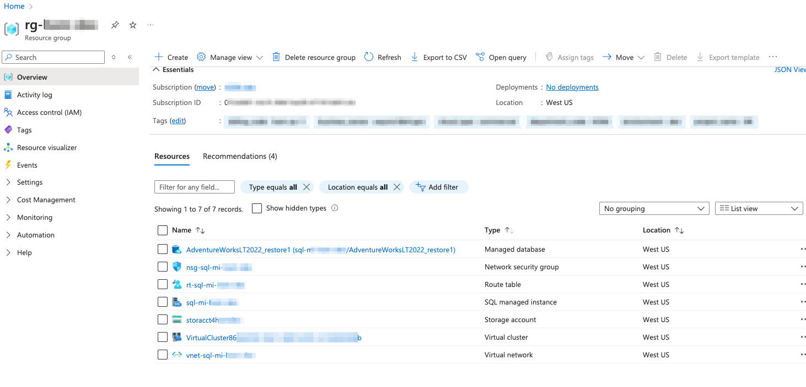
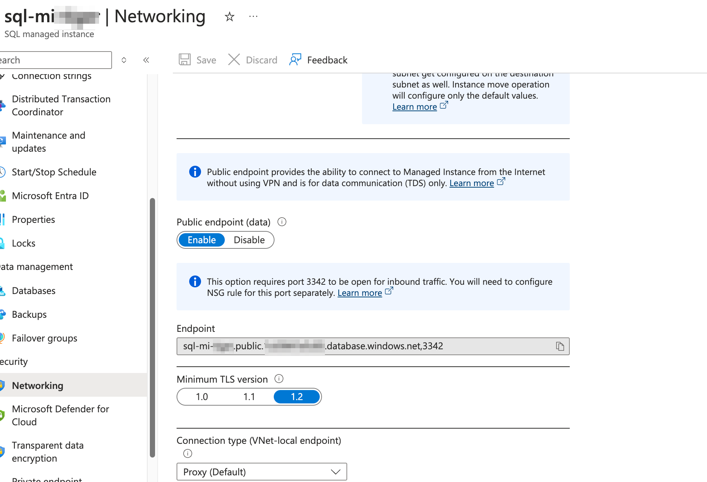
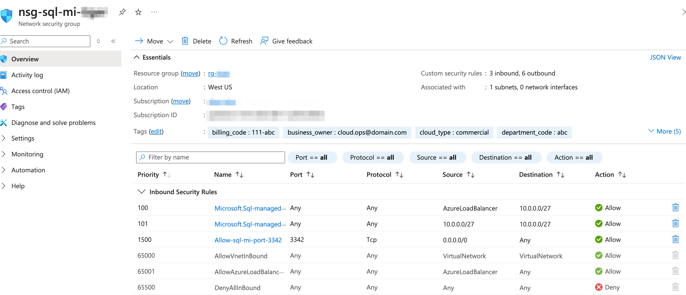
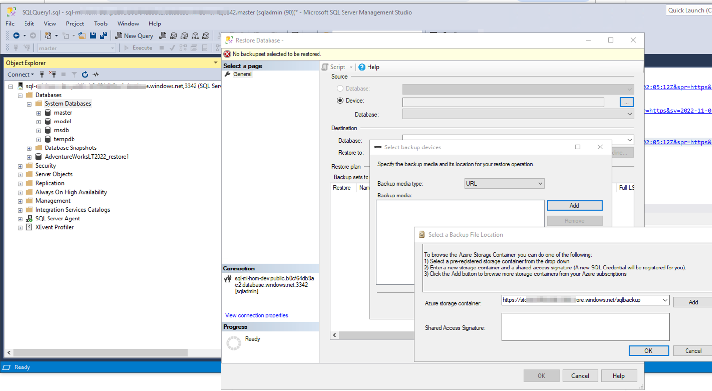

### azure resource group

- terraform [azurerm_resource_group | Resources | hashicorp/azurerm | Terraform | Terraform Registry](https://registry.terraform.io/providers/hashicorp/azurerm/latest/docs/resources/resource_group)
- overview [Azure Resource Manager overview - Azure Resource Manager | Microsoft Learn](https://learn.microsoft.com/en-us/azure/azure-resource-manager/management/overview)
- manage resource group [Manage resource groups - Azure portal - Azure Resource Manager | Microsoft Learn](https://learn.microsoft.com/en-us/azure/azure-resource-manager/management/manage-resource-groups-portal)
- 

### azure sql managed instance

- terraform [azurerm_mssql_managed_instance | Resources | hashicorp/azurerm | Terraform | Terraform Registry](https://registry.terraform.io/providers/hashicorp/azurerm/latest/docs/resources/mssql_managed_instance)
- terraform ad & entra id admin https://registry.terraform.io/providers/hashicorp/azurerm/latest/docs/resources/mssql_managed_instance
- azure sql managed instance [azurerm_mssql_managed_instance | Resources | hashicorp/azurerm | Terraform | Terraform Registry](https://registry.terraform.io/providers/hashicorp/azurerm/latest/docs/resources/mssql_managed_instance)
- azure sql databse elstic pool [Manage multiple databases with elastic pools - Azure SQL Database | Microsoft Learn](https://learn.microsoft.com/en-us/azure/azure-sql/database/elastic-pool-overview?view=azuresql)
- migration guide [SQL Server to Azure SQL Managed Instance: Migration guide | Microsoft Learn](https://learn.microsoft.com/en-us/data-migration/sql-server/managed-instance/guide)
- security [Security Overview - Azure SQL Database &amp; Azure SQL Managed Instance &amp; Azure Synapse Analytics | Microsoft Learn](https://learn.microsoft.com/en-us/azure/azure-sql/database/security-overview?view=azuresql)
- plan and manage cost [Plan and manage costs - Azure SQL Database | Microsoft Learn](https://learn.microsoft.com/en-us/azure/azure-sql/database/cost-management?view=azuresql&viewFallbackFrom=azuresql-mi)
- monitor [Monitor Azure SQL Managed Instance - Azure SQL Managed Instance | Microsoft Learn](https://learn.microsoft.com/en-us/azure/azure-sql/managed-instance/monitoring-sql-managed-instance-azure-monitor?view=azuresql)
- server-level firewall [Connectivity architecture - Azure SQL Managed Instance | Microsoft Learn](https://learn.microsoft.com/en-us/azure/azure-sql/managed-instance/connectivity-architecture-overview?view=azuresql)
- microsoft entra authentication [Connect with Microsoft Entra authentication - Azure SQL Database &amp; SQL Managed Instance &amp; Azure Synapse Analytics | Microsoft Learn](https://learn.microsoft.com/en-us/azure/azure-sql/database/authentication-microsoft-entra-connect-to-azure-sql?view=azuresql)
- service principal [Microsoft Entra server principals - Azure SQL Database &amp; Azure SQL Managed Instance &amp; Azure Synapse Analytics | Microsoft Learn](https://learn.microsoft.com/en-us/azure/azure-sql/database/authentication-azure-ad-logins?view=azuresql)
- managed identity [Managed identity in Microsoft Entra for Azure SQL - Azure SQL Database &amp; Azure SQL Managed Instance | Microsoft Learn](https://learn.microsoft.com/en-us/azure/azure-sql/database/authentication-azure-ad-user-assigned-managed-identity?view=azuresql)





### azure storage account & blob

- terraform [azurerm_storage_account | Resources | hashicorp/azurerm | Terraform | Terraform Registry](https://registry.terraform.io/providers/hashicorp/azurerm/latest/docs/resources/storage_account)
- overview [Storage account overview - Azure Storage | Microsoft Learn](https://learn.microsoft.com/en-us/azure/storage/common/storage-account-overview)
- blob encryption [Check the encryption status of a blob - Azure Storage | Microsoft Learn](https://learn.microsoft.com/en-us/azure/storage/blobs/storage-blob-encryption-status?tabs=portal)

### IaC terraform script

```bash
## az cli https://learn.microsoft.com/en-us/cli/azure/
az cloud set --name azurecloud
az login

az account list
az account show
az account set --subscription 

## or azure cloud shell https://learn.microsoft.com/en-us/azure/cloud-shell/overview

## https://developer.hashicorp.com/terraform/install
cd terraform
# Clean the provider cache
#rm -rf .terraform
#rm -f .terraform.lock.hcl

terraform init
## terraform init -upgrade
#terraform console
terraform plan
terraform apply --auto-approve
terraform show ## Show the current state
terraform output --json ##sql database connection string with credential - DONOT share or checkin to git repo

## get the publish profiles for the app service - ftp, sftp ...
az webapp deployment list-publishing-profiles --name <your_app_service_name> --resource-group <your_resource_group_name> --output json

## clean resource, rerun it if resource did not be cleaned fully
terraform destroy --auto-approve

```

### manage a stop and start schedule

- managed instance start/stop scedule - [Stop and start an instance - Azure SQL Managed Instance | Microsoft Learn](https://learn.microsoft.com/en-us/azure/azure-sql/managed-instance/instance-stop-start-how-to?view=azuresql&tabs=azure-cli-prep%2Cazure-cli)

- ```bash
instanceName="sql-mi-tiger"
resourceGroupName="rg-tiger"

## create schedule M-F
scheduleItems="[{'startDay':'Monday','startTime':'8:00','stopDay':'Monday','stopTime':'17:00'},{'startDay':'Tuesday','startTime':'8:00','stopDay':'Tuesday','stopTime':'17:00'},{'startDay':'Wednesday','startTime':'8:00','stopDay':'Wednesday','stopTime':'17:00'},{'startDay':'Thursday','startTime':'8:00','stopDay':'Thursday','stopTime':'17:00'},{'startDay':'Friday','startTime':'8:00','stopDay':'Friday','stopTime':'17:00'}]"

##timezone="Central Europe Standard Time"
timezone="Pacific Standard Time"


az sql mi start-stop-schedule create --mi "$instanceName" -g "$resourceGroupName" --timezone-id "$timezone" --schedule-list "$scheduleItems"

# check a scedule
az sql mi start-stop-schedule show --mi "$instanceName" -g "$resourceGroupName"

# append an item
newScheduleItem="{'startDay':'Friday','startTime':'09:00 PM','stopDay':'Friday','stopTime':'11:00 PM'}"
az sql mi start-stop-schedule update --mi $instanceName -g $resourceGroupName --add schedule_list "$newScheduleItem"

# remove an item
#items in list are indexed (0 based)
az sql mi start-stop-schedule update --mi $instanceName -g $resourceGroupName --remove schedule_list 2

# delete all schedule
az sql mi start-stop-schedule delete --mi "$instanceName" -g "$resourceGroupName"
```

### sqlcmd restore bak file

```bash
# Variables
# TODO 
managedInstanceFQDN="your-managed-instance-fqdn.public.dnszoneid12345678.database.windows.net,3342"
adminUser="your-admin-username"
adminPassword="your-admin-password"
storageAccountName="your-storage-account-name"
storageAccountKey="your-storage-account-key"
containerName="your-container-name"
backupFileName="AdventureWorksLT2022.bak"
databaseName="AdventureWorksLT2022"

# Create a credential in the SQL Managed Instance
sqlcmd -S $managedInstanceFQDN -U $adminUser -P $adminPassword -Q "CREATE CREDENTIAL [https://$storageAccountName.blob.core.windows.net/$containerName] WITH IDENTITY='SHARED ACCESS SIGNATURE', SECRET='$storageAccountKey'"

# Restore the database
sqlcmd -S $managedInstanceFQDN -U $adminUser -P $adminPassword -Q "RESTORE DATABASE [$databaseName] FROM URL = 'https://$storageAccountName.blob.core.windows.net/$containerName/$backupFileName' WITH FILE = 1, NOUNLOAD, STATS = 5"

```

### restore bak from SQL Management Studio 20 on windows PC

- 
