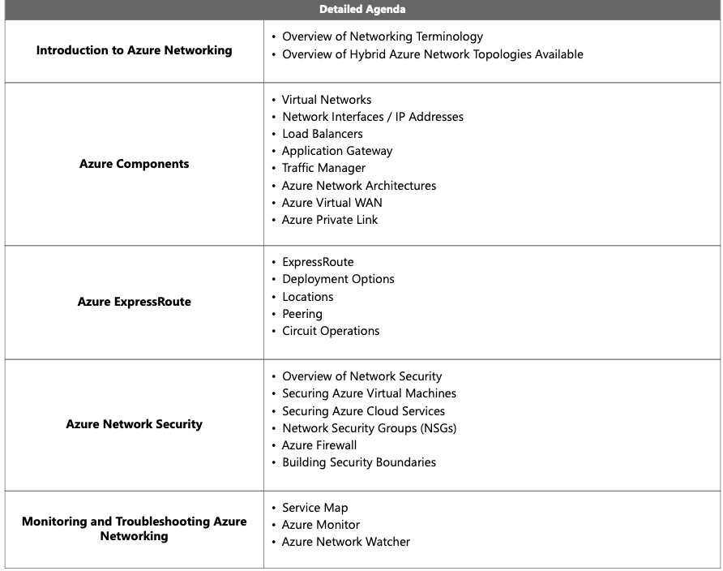

#### networking essentials 

- azure status/ potntial ongoing outages or issues https://azure.status.microsoft/en-us/status
- azure update / all updates & news features https://azure.microsoft.com/en-us/updates/
- vm sizes/specs https://learn.microsoft.com/en-us/azure/virtual-machines/sizes/overview?tabs=breakdownseries%2Cgeneralsizelist%2Ccomputesizelist%2Cmemorysizelist%2Cstoragesizelist%2Cgpusizelist%2Cfpgasizelist%2Chpcsizelist
- ip ranges and service tags
- - https://www.microsoft.com/en-us/download/details.aspx?id=56519
  - https://www.microsoft.com/en-us/download/details.aspx?id=57063
- load-balancing options https://learn.microsoft.com/en-us/azure/architecture/guide/technology-choices/load-balancing-overview
- expressroute locations https://learn.microsoft.com/en-us/azure/expressroute/expressroute-locations-providers?tabs=america%2Ca-c%2Ca-k
- azure limitations https://learn.microsoft.com/en-us/azure/azure-resource-manager/management/azure-subscription-service-limits
