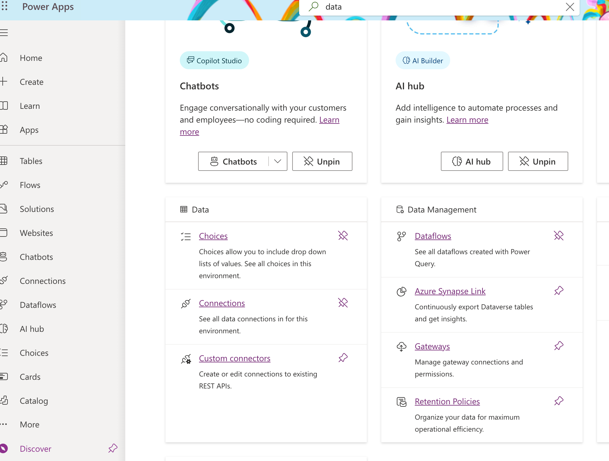
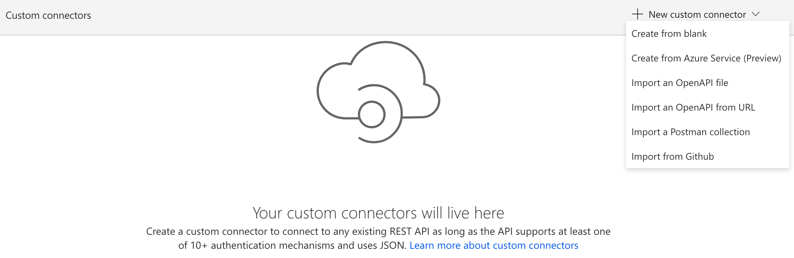
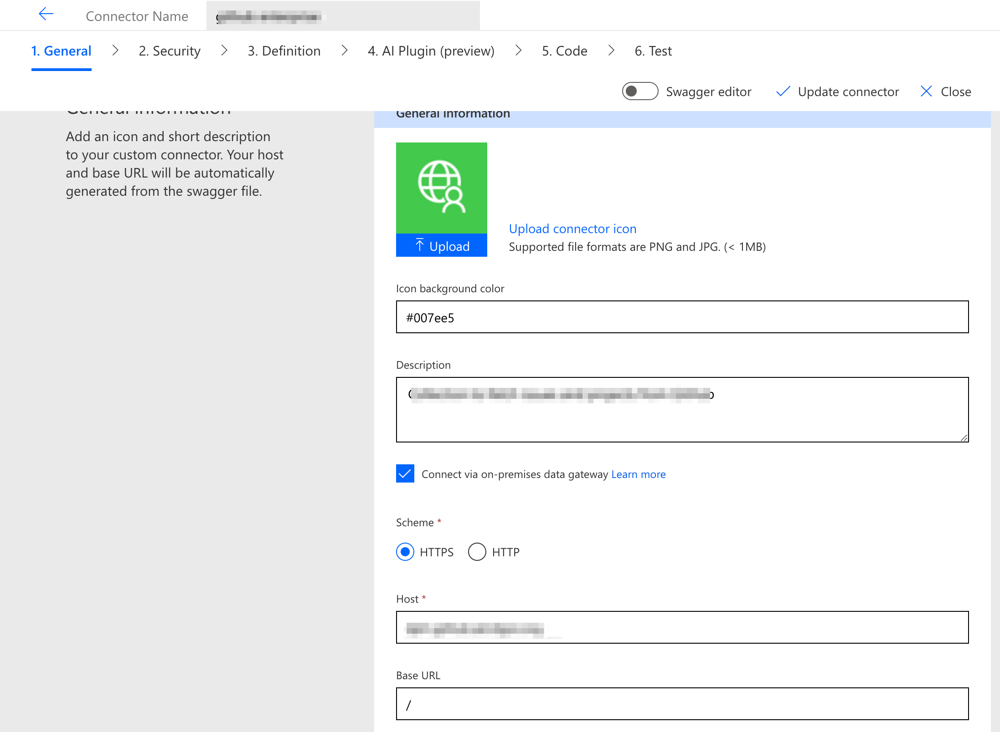
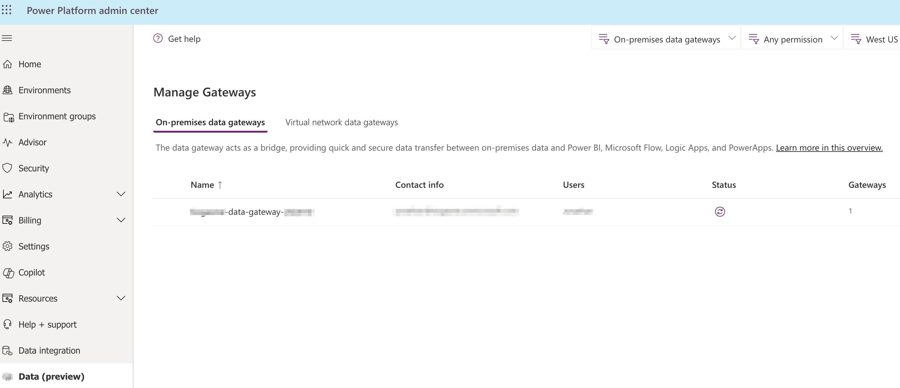

### Power Apps US Government service URLs

You use a different set of URLs to access Power Apps US Government environments, as shown in the following table (the commercial URLs are also shown for contextual reference, in case they are more readily familiar to you).

Expand table

| **Commercial version URL**                                                     | **US Government version URL**                                                                                                                                                                                                                                         |
| ------------------------------------------------------------------------------------ | --------------------------------------------------------------------------------------------------------------------------------------------------------------------------------------------------------------------------------------------------------------------------- |
| [https://make.powerapps.com](https://make.powerapps.com/)                               | [https://make.gov.powerapps.us](https://make.gov.powerapps.us/) (GCC) [https://make.high.powerapps.us](https://make.high.powerapps.us/) (GCC High) [https://make.apps.appsplatform.us](https://make.apps.appsplatform.us/) (DoD)                                           |
| [https://create.powerapps.com](https://create.powerapps.com/)                           | [https://make.gov.powerapps.us](https://make.gov.powerapps.us/) (GCC)``[https://make.high.powerapps.us](https://make.high.powerapps.us/) (GCC High)``[https://make.apps.appsplatform.us](https://make.apps.appsplatform.us/) (DoD)                                                |
| [https://flow.microsoft.com/connectors](https://flow.microsoft.com/connectors)          | [https://gov.flow.microsoft.us/connectors](https://gov.flow.microsoft.us/connectors) ``[https://high.flow.microsoft.us/connectors](https://high.flow.microsoft.us/connectors) (GCC High)``[https://flow.appsplatform.us](https://flow.appsplatform.us/) (DoD)                     |
| [https://admin.powerplatform.microsoft.com](https://admin.powerplatform.microsoft.com/) | [https://gcc.admin.powerplatform.microsoft.us](https://gcc.admin.powerplatform.microsoft.us/) ``[https://high.admin.powerplatform.microsoft.us](https://high.admin.powerplatform.microsoft.us/) (GCC High)``[https://admin.appsplatform.us](https://admin.appsplatform.us/) (DoD) |
| [https://apps.powerapps.com](https://apps.powerapps.com/)                               | [https://play.apps.appsplatform.us](https://play.apps.appsplatform.us/) (GCC)``[https://apps.high.powerapps.us](https://apps.high.powerapps.us/) (GCC High)``[https://play.apps.appsplatform.us](https://play.apps.appsplatform.us/) (DoD)                                        |

For those customers that implement network restrictions, ensure access to the following domains are made available to your end-users' access points:

**GCC Customers:**

*.microsoft.us
*.powerapps.us
*.azure-apihub.us
*.azure.net
*.azure.us
*.azureedge.net
*.azureedge.us
*.usgovcloudapi.net
*.microsoftonline.com
*.microsoft.com
*.windows.net
*.crm9.dynamics.com
*.dynamics365portals.us

Also, refer to the [Required IP Ranges](https://www.microsoft.com/download/confirmation.aspx?id=57063) to enable access to environments that users and administrators may create within your tenants well as other Azure services leveraged by the platform:

* GCC and GCC High: (Focus on AzureCloud.usgovtexas and AzureCloud.usgovvirginia)
* DoD: Focus on USDoD East and USDoD Central

**GCC High and DoD Customers:**

*.microsoft.us
*.powerapps.us
*.azure-apihub.us
*.azure.net
*.azure.us
*.azureedge.net
*.azureedge.us
*.usgovcloudapi.net
*.microsoftonline.us
*.microsoftdynamics.us (GCC High)
*.crm.microsoftdynamics.us (GCC High)
*.high.dynamics365portals.us (GCC High)
*.appsplatform.us (DoD)
*.crm.appsplatform.us (DoD)
*.appsplatformportals.us (DoD)

Also, refer to the [Required IP Ranges](https://www.microsoft.com/download/confirmation.aspx?id=57063) to enable access to environments that users and administrators may create within your tenant as well as other Azure services leveraged by the platform:

* GCC and GCC High: (Focus on AzureCloud.usgovtexas and AzureCloud.usgovvirginia)
* DoD: Focus on USDoD East and USDoD Central

### power automate custom connector

- More -> Discover All
  

  

  

  - https://learn.microsoft.com/en-us/power-automate/developer/register-custom-api
  - https://learn.microsoft.com/en-us/connectors/custom-connectors/

  **Steps to Create a Custom Connector in Power Automate**

  1. **Create a Custom Connector**:

     - Go to Power Automate.
     - Navigate to "Data" > "Custom connectors".
     - Click on "+ New custom connector" and select "Create from blank".
  2. **General Information**:

     - Provide a name for your custom connector.
     - Click "Continue".
  3. **Host and Base URL**:

     - Set the "Host" to `api.domain.com`.
     - Set the "Base URL" to `/`.
  4. **Authentication**:

     - Choose "API Key" as the authentication type.
     - Set the parameter label to "Authorization".
     - Set the parameter name to [`Authorization`](command:_github.copilot.openSymbolFromReferences?%5B%22%22%2C%5B%7B%22uri%22%3A%7B%22scheme%22%3A%22file%22%2C%22authority%22%3A%22%22%2C%22path%22%3A%22%2FUsers%2Fjonathan%2Fdev%2Fgithub%2Fcloud-skill-boost%2Fccsf%2Fdph-github%2Fccsf-dph-github-restful-api.sh%22%2C%22query%22%3A%22%22%2C%22fragment%22%3A%22%22%7D%2C%22pos%22%3A%7B%22line%22%3A11%2C%22character%22%3A14%7D%7D%5D%2C%2283ccbf1e-5982-4349-b762-d82ef617c55b%22%5D "Go to definition").
     - Set the location to "Header".
  5. **Define the API**:

     - Go to the "Definition" tab.
     - Click on "+ New action" to define a new action.
     - Provide a summary and description for the action.
     - Set the operation ID (e.g., `GetIssues`).
  6. **Request**:

     - Click on "Import from sample".
     - Select "GET" as the method.
     - Enter the URL: `https://api.domain.com/repos/{owner}/{repo}/issues`.
     - Add the required headers:
       - `Authorization: token {PAT}`
       - `Accept: application/vnd.github.v3+json`
     - Click "Import".
  7. **Response**:

     - Define the response schema by providing a sample response or manually defining the schema.
  8. **Test the Connector**:

     - Go to the "Test" tab.
     - Create a new connection using your GitHub personal access token (PAT).
     - Test the action to ensure it works as expected.

  ### powerplatform admin site
- https://admin.powerplatform.microsoft.com/ext/DataGateways

  
